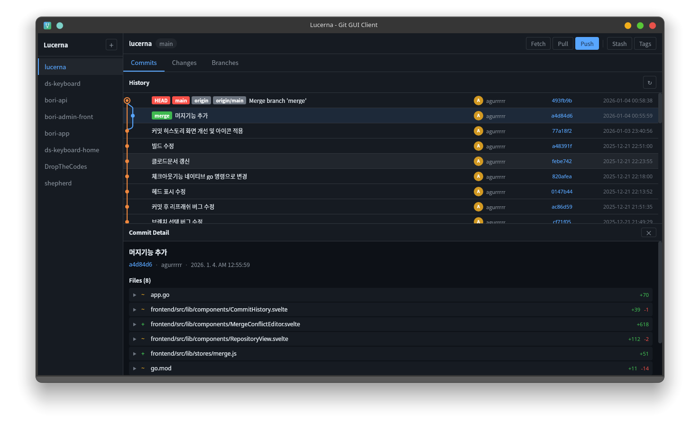

# Lucerna

A modern, cross-platform Git GUI client built with [Wails](https://wails.io/) and [Svelte](https://svelte.dev/). Inspired by [Fork](https://git-fork.com/).

[한국어](./README_KO.md)

## Screenshot



## Features

- **Repository Management** — Open local repositories, monitor status in real-time, recent repository list
- **Commit History & Visualization** — Timeline with pagination, SVG-based commit graph, file-level commit history, git blame view
- **Diff Viewer** — Unified diff view, file statistics (additions/deletions), syntax-aware display
- **Staging & Commit** — Stage/unstage individual files or all changes, commit with validation
- **Branch Management** — Create, delete, rename, checkout, merge branches; create branches from any commit
- **Remote Operations** — Fetch, pull, push (with force push option), manage multiple remotes, credential storage
- **Stash** — Create (with untracked files option), apply, pop, drop, clear
- **Tags** — Create annotated/lightweight tags, list, delete
- **Merge Conflict Resolution** — Three-way diff editor for resolving conflicts
- **Cherry-pick & Revert** — Cherry-pick and revert individual commits

## Tech Stack

| Layer | Technology |
|-------|-----------|
| Backend | Go 1.24, Wails v2 |
| Frontend | Svelte 4, Vite 5 |
| Git | go-git v5 + native git CLI |
| Platforms | Linux, macOS, Windows |

## Getting Started

### Prerequisites

- [Go](https://go.dev/) 1.24+
- [Node.js](https://nodejs.org/) 18+
- [Wails CLI](https://wails.io/docs/gettingstarted/installation) v2

**Linux only:**
```bash
sudo apt-get install libgtk-3-dev libwebkit2gtk-4.1-dev
```

### Development

```bash
# Clone the repository
git clone https://github.com/yourusername/lucerna.git
cd lucerna

# Install frontend dependencies
cd frontend && npm install --legacy-peer-deps && cd ..

# Run in development mode
wails dev
```

### Build

```bash
# Build for current platform
wails build

# Linux (with webkit2gtk-4.1 support)
wails build -tags webkit2_41

# macOS (Universal Binary)
wails build -platform darwin/universal

# Windows
wails build -platform windows/amd64
```

See [BUILD.md](./BUILD.md) for detailed build instructions.

## Download

Pre-built binaries are available on the [Releases](https://github.com/yourusername/lucerna/releases) page:

| Platform | File |
|----------|------|
| Linux | `lucerna-{version}-linux-amd64.tar.gz` |
| macOS | `lucerna-{version}-darwin-amd64.tar.gz` (Universal Binary) |
| Windows | `lucerna-{version}-windows-amd64.zip` |

## Project Structure

```
lucerna/
├── main.go                          # Wails application entry point
├── app.go                           # App methods (Wails bindings / API)
├── internal/
│   ├── git/                         # Git operations
│   │   ├── repository.go            # Repository management
│   │   ├── commit.go                # Commit operations
│   │   ├── branch.go                # Branch management
│   │   ├── diff.go                  # Diff generation
│   │   ├── stage.go                 # Staging & commit creation
│   │   ├── remote.go                # Remote operations
│   │   ├── merge.go                 # Merge & conflict resolution
│   │   ├── stash.go                 # Stash operations
│   │   ├── tag.go                   # Tag operations
│   │   ├── history.go               # File history & blame
│   │   └── credentials.go           # Credential storage (AES-GCM encrypted)
│   └── models/                      # Data models
├── frontend/                        # Svelte frontend
│   └── src/
│       ├── App.svelte               # Main application
│       ├── lib/
│       │   ├── components/          # UI components
│       │   └── stores/              # Svelte stores (state management)
│       └── main.js
├── assets/                          # App icons
├── .github/workflows/               # CI/CD (build + release)
├── wails.json                       # Wails configuration
└── install.sh                       # Linux install script
```

## CI/CD

This project uses GitHub Actions for automated builds:

- **Build**: Triggers on push/PR to `main` — builds for Linux, macOS, and Windows
- **Release**: Triggers on `v*.*.*` tags — creates GitHub Release with all platform binaries

## Contributing

Contributions are welcome! Please feel free to submit a Pull Request.

1. Fork the repository
2. Create your feature branch (`git checkout -b feature/amazing-feature`)
3. Commit your changes (`git commit -m 'Add some amazing feature'`)
4. Push to the branch (`git push origin feature/amazing-feature`)
5. Open a Pull Request

## License

This project is licensed under the MIT License — see the [LICENSE](./LICENSE) file for details.

---

> **"Your word is a lamp for my feet, a light on my path."**
>
> *— Psalm 119:105 (NIV)*
